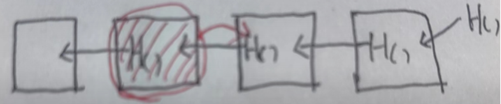
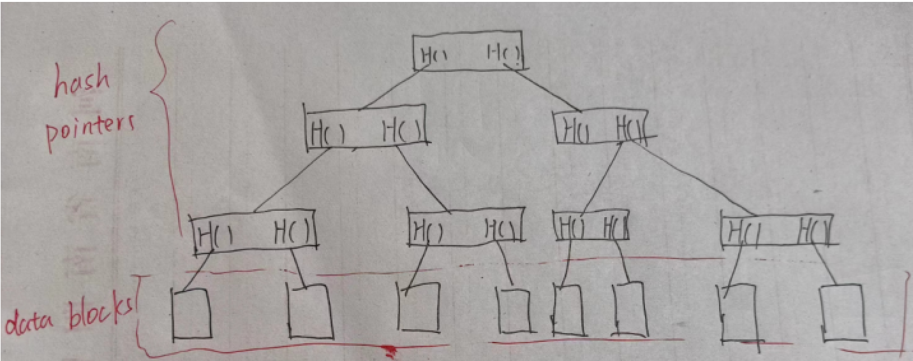

# 区块链技术理论（1）——比特币（1）

## 密码学原理

比特币使用密码学  哈希  和  签名  的功能

### 哈希 cryptographic hash function

#### 性质一：不可制造人为碰撞性 collision resistance

**是什么？**

输入不同，哈希结果相同：x !=y  但 H(x)=H(y)

**为什么产生？**

输入空间(2^256) < 输出空间(∞)（鸽笼原理）

**什么叫collision resistance？**

“没有办法篡改内容而不被检测出来”——防篡改

即现有内容记为 *n* 篡改后内容为 *m*  ；collision resistance性质保证无法有 H(m)==H(n)

**应用举例**

你想下载一个文件，但是如何确定文件是正版的哪？可以计算一下下载文件的哈希值，和正版文件的哈希值对比一下，如果哈希值相同就可以判断二者一致，即下载的是正版文件。

**collision resistance性质靠谱吗？**

在数学理论上，无法证明是不可碰撞的

但是在实践中 大多哈希函数无法制造人为的哈希碰撞

#### 性质二：单向性 hiding

**是什么？**

x-------->H(x)

**实现条件？**

1. 输入空间足够大，使枚举求解无法实现
2. 输入对应的输出结果是均匀的 防止出现很多个输入对应一个输出（是不是想到了collision resistance的一一对应特性？）

#### 两种性质结合的实例：digital commitment

**密封信sealed envelope** 

1. 某人预测一个股票可能在4.28会涨停，如果他在4.28前公布出预测结果可能影响股市；而如果在4.28后公开又不能说明这是他提前一天预测的结果。
2. 我们可以将预测结果在4.28前放进一个密封的信封，交给公众信得过的人保存，在4.28后打开查看结果即可
3. 那么如何创建一个电子信封哪？

**电子密封信digital equivalent of a sealed envelope** 

1. 4.28前将预测结果的哈希值计算出来公布出来（由于单向性，预测内容不会公开）
2. 4.28之后将预测结果公布，并且计算其对应的哈希值，看是不是一样的
3. 有没有发现问题？这个输入不符合单向性的方法，他的输入是有限的（毕竟股票号码就那么多）而为了保证我们的预测结果不会被暴力求解出来，往往采用如下方法
4. H(x||nonce)通过添加后缀的方法，保证输入结果数量足够越大，且输出结果是均匀的

#### 性质三：无捷径性 puzzle friendly（比特币所需的性质）

1. 补充概念Pow：枚举（nonce）使得 Hash<=target(即前几位全是0) 

（详细可以去看我的《简易区块链实现（3）—工作量证明》）

2. puzzle friendly指的是 枚举nonce产生满足条件的Hash的过程没有捷径，也正因为这个性质，才可以用做Pow

3. 题外话：设计Pow时，还要注意 hard to find but easy to verify
4. 比特币使用到的哈希算法是sha256

### 签名—比特币系统中的账户管理

#### 账户的本质是什么？

1. 账本的创建要区块链去中心化的要求，因此不需要一个所谓的“银行”来承认和批准你的账户
2. 创建账本时，会在本地生成一个公私钥对（这个钥匙对采取的是 非对称加密asymmetric encryption aborithm 的方法）
3. 显然，账户的本质就是一个**公钥私钥对**，公钥是账户，私钥是密码！那么，转账又是怎么实现的哪？
4. 我们先来看一下非对称加密

#### 非对称加密

**是什么？**

非对称加密：与对称加密不同的是，非对称加密创建了一个 **钥匙对**（公钥，私钥），公钥用来加密，私钥用来解密。

**为什么？**

传统的加密方式，使用一个钥匙（密码本）来进行加密和解密。

在互联网上，我们公布的密文是所有人可见的，明文是使用密码本翻译出来的。当你将这个密码本传给别人的时候可能会被第三方截获。这样的话结合你公布的密文，这个明文就很容易被翻译出来。

**加密流程：**

1. A B两个人分别创建一个钥匙对，简称为（Ap，As），（Bp，Bs）【p:public     s:self】
2. 现在，将私钥储存在本地，将公钥公布到互联网上。
3. 如果A想给B发一条加密消息，那么A使用B在互联网上公布的公钥（Bp）来进行加密，之后将密文公布。B得到密文之后，使用自己本地的私钥（Bs）进行解密。

#### 签名——转账的实现

**如何实现一笔转账？**

1. 现在A想向B转账1eth，在这个去中心化的体系应该如何实现？
2. A广播这条消息“向B转账1eth”，大家接受到这条消息之后记账，交易完成。

**转账存在的问题**

我们如何确定转账的是A，不是其他人伪造的哪？

这就需要引入  **数字签名**  技术了

**问题解决——签名的作用**

我们优化了上述的转账流程

1. 首先，A广播一条转账，并且通过私钥将自己的数字签名一并发布上去
2. 之后，大家收到这条转账之后通过 签名 和 A的公钥Ap 来验证发出者是不是A本人

**公私钥对在转账和签名中的用途**

使用私钥来创建签名，使用公钥来验证签名

**这种账户的问题**

1. 如果我们通过不断的枚举，有没有一种可能产生和现有账户一样的公私钥对？那样的话我们就可以转出他账户的钱哪？
2. 因此，这就对我们的单向性有很大的考验，我们需要一个好的随机源（a good resource of random），不仅要在创建账户的时候随机源要好，在产生数字签名时随机源也要好。

## 数据结构

### 哈希指针（hash pointer）

**是什么？**

哈希指针内部存储的是 **结构体的位置** 和 **结构体的哈希值**

**意义**

不仅可以找到结构体存储的位置，而且可以检测结构体内容是否被篡改

#### 区块链（blockchain）

**与普通链表有什么区别？**

1. 使用哈希指针代替普通指针
2. 创建区块链时，第一个区块被称为 创世区块 
3. 每个哈希指针中的哈希值计算都是通过 上一个区块的全部信息（字节切片）经过哈希计算得到的

**数据结构优点**

1. 假设第二个区块被修改，那么第三个区块的原有指针对不上，第三个区块的哈希指针要改。而第三个哈希指针改动，导致整个第三区块内容（哈希指针部分）改动，第四个区块哈希指针（指向第三区块）里的哈希值也要改动......最总导致改动到指向最后一个区块的哈希指针的哈希值！

2. 得到指向最后一个区块地址的哈希指针之后，我们可以验证前面的哈希值区块有没有被篡改。

   这使得分布式网络的节点只用拿到最后几个区块的信息就可以如果有需要的话向其他节点索要先前区块，并且可以验证提供的先前区块是否被篡改。

### 默尔克树（Merkle tree）

**构造方法**

1. 下方数据区的数据块取哈希值存到上方的节点
2. 上方两个哈希值组成的 数据块再取哈希传到上方 
3. 以此类推，得到一个根节点（一层层推上去）
4. 根节点也可以取一个哈希，叫做 root hash

**有什么好处？**

只需要记住一个根节点，就可以判断默尔克树是否存在被修改的数据块

**区块链数据结构分类应用**

在比特币体系中：

1. 区块与区块之间是以区块链的方式链接，这样方便产生新的区块

2. 在一个区块里，交易（transaction）之间是以默尔克树形式链接

   可以参考（简易区块链搭建(3)----交易）

3. 在一个区块里面，分为区块头（block header），区块体（block body）。其中，根节点哈希值存放在区块头。

#### 默尔克树应用 merkle proof

**全节点和轻节点**

1. 分布式网络里面的节点分为 全节点 轻节点（全节点是存储全部数据的节点 存储了 block_header和block_body  而轻节点存储的只有block_header）

2. 全节点是网络中的完整参与者，它们存储了整个区块链的完整副本，并参与网络中的所有交易验证和区块确认工作。全节点需要下载并保持整个区块链的副本，因此需要更多的存储空间和带宽。

3. 轻节点是网络中的轻量级参与者，它们只保存了区块链的部分数据，通常是只保存了自己相关的交易数据。

   一般账户都是轻节点

（材料来源：《区块链技术与应用公开课》）

##### 

##### **proof of membership**

**如何向一个轻节点证明一笔交易存在？**

我们拿上图举例，轻节点掌握第四区块里的block_header，它如何验证黄色交易tx存在？

1. 轻节点向全节点索要验证所需的哈希值
2. 全节点提供 红色的三个哈希值 
3. 收到哈希值之后，节点计算 tx 对应的哈希值，即最下方的绿色H()，之后，结合最下方的红色哈希值组成的数据块计算第二层的绿色哈希值，以此类推。最后得到根哈希值，和自己block_header的根哈希值对照一下，如果一样，则交易被写进莫尔克树中。
4. 时间复杂度为log(n) (n为默尔克树的交易tx个数)

**可能存在攻击？**

我向A进行交易tx，但是我很坏，我上链的是交易tx2。这时候，我伪造三个哈希值，使得tx交易计算出的最下层绿色H()做一遍merkle proof后，得到的是根哈希值。

这就实现了我上传的是假交易tx2，而A以为我上链的是交易tx。可行吗？

实际上，这种方法是不可行的。因为我刚刚在做的就是  *人为制造哈希碰撞*  

而比特币的一条性质是collision resistance（上文介绍过），就是不可制造人为碰撞性！

##### proof of inclusion（比特币不需要这个功能）

（材料来源：《区块链技术与应用公开课》）

如果我们想证明一个交易不存在于这个默尔克树里面，应该怎么做呢？

显然的方法是计算每一个tx，按照上述PoM的方法证明，算法复杂度为nlog(n)

现在，我们想一个简单的方法——sorted meikle tree，即将区块按照哈希值从小到大的顺序排列。如果我们想验证一个交易tx不存在，就只需计算它的哈希值，然后找到和他紧挨着的两个区块（如图中的两个黄块）。之后，我们将这两个相邻的哈希值组成数据块，走一遍proof of membership的流程，算出的的根哈希如果和block_header里的一样，就说明这两个数据块tx1，tx2是紧邻的，中间不存在其他交易，即证明了交易不存在。

**哈希指针的局限**

哈希指针可以代替普通指针，除了环状数据结构（因为没法产生第一个哈希值）
