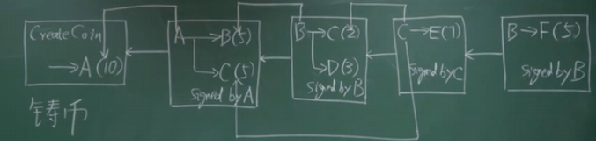
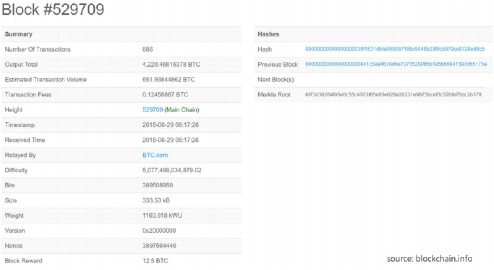
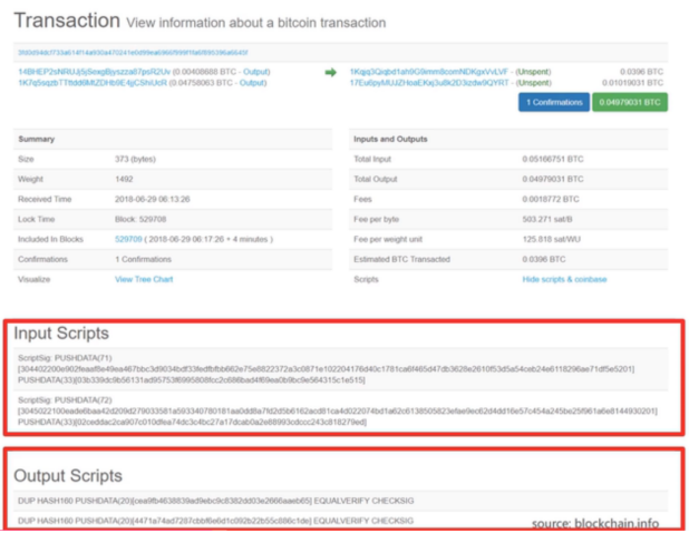
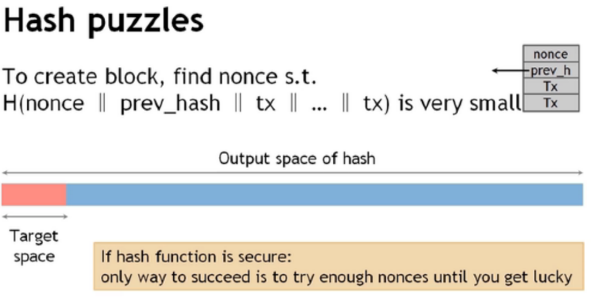
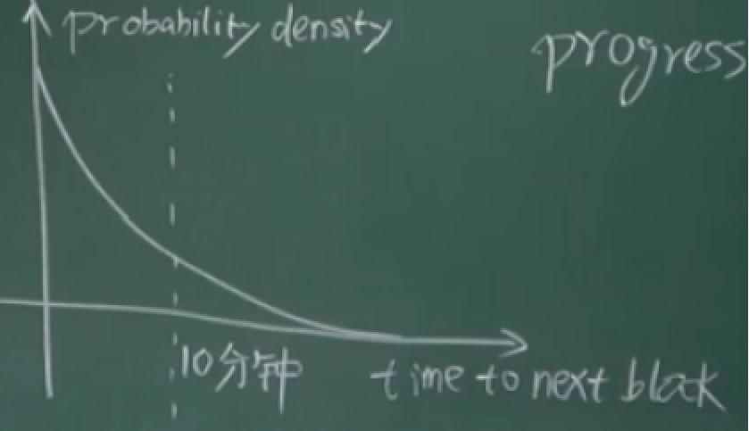

# 比特币（2）——协议与实现

## 协议

### 数字货币

一个去中心化的数字货币，要满足两点：

1. 谁有权发行货币
2. 怎么验证交易的合法性

#### 中心化数字货币

**一套不加区块链功能的数字货币**

首先，我们直接想到的数字货币的数据结构是： *面值 + 数字签名*

然而，这样的货币会遇到一个问题。就是我现在有一块钱的数字货币。买B的一串烧烤时，给这个货币文件发给他，他验证发现是真钞。然后我又买C的一杯水，给这个货币文件发给他，他也验证发现是真钞。

这就是 **双花问题**（多次花费），造成这种问题的原因就是 *数字货币复制成本几乎为零*

**数字货币系统的可行实践**

直接想到的办法是：

央行创建一个数据库，记录每个货币的归属权

问题是，有必要吗？

#### 区块链去中心化数字货币

下方的箭头是指向币的来源的哈希指针，不仅可以遍历交易信息来计算账户里面含有的币的数量。而且还可以用来验证签名的是不是本账户。

比特币的验证过程是通过脚本实现的：

每个交易的输入是一段脚本，交易的公钥是在输入的脚本里指定的，交易的输出也是脚本。

验证一个交易是不是合法的，就是要将当前交易的输入脚本，和提供币来源的输出脚本拼在一起，看能不能顺利执行。如果能执行，说明是合法的。

之后会详述脚本（bitcoin script）。

##### **转账的预备条件**

A给B转账

1. 币的来源：转账的查询不是查询账户有多少币，而是通过遍历以前的交易来计算某个账户现有的币（可参考简易区块链实现（3）——交易）
2. 所有节点要知道A的公钥，以此来验证转出者的签名是不是A的（每个节点独立验证）。
3. A要知道B的地址：A给B转账，A如何得知B的地址？————B以公钥的形式公布出来

问题：现在有一个B的同伙C，想要和B合伙偷取A的钱。他可以吧自己的公钥说成A的公布出来，然后用自己的签名给其他节点验证。验证后发现，签名是“A”的，因此承认该交易。如何防止这种现象的影响呢？

在铸币区块里面，有一个coinbase tx，里面记录着A的公钥的哈希。如果C把自己的公钥说成是A的公钥，那么他公钥的哈希就和 coinbase tx 里面的哈希对不上了，验证就不能通过了，这样就保证了上面的攻击不会实现。

##### **区块结构**

###### ***BlockHeader（区块的宏观信息）***

1. version（比特币的哪个版本的协议）

2. hash of previous block header（指向前一个区块的指针）**（前一个区块的哈希，只算的是区块的块头）**

  

3. merkle root hash(默尔克树的根哈希值)

4. target(挖矿难度 目标阈值的编码)

5. nonce(随机数)

###### *BlockBody*

transaction list(交易列表)

##### 节点分类

###### full node（fully validating node）

少部分节点，可以验证交易的合法性。

参与了区块链的构造与维护。

###### light node

大多数节点，可以验证交易的合法性

账本的内容要取得分布式的共识

##### 分布式系统

如果我在本地记录一个区块，之后直接将它上传到区块链上，可以吗？

显然是不行的，因为不同人记录的区块可能不一样。

这就是**账本的内容要取得分布式的共识**（distributed consensus）

###### 举例：分布式哈希表（distributed hash table）

这个哈希表是全局性的——即我在A机器上记录一个“like”-->136,你在B机器上可以读出来

###### 分布式不可能结论（简介）

FLP impossibility result

在一个异部（延时无上限）的系统中，倘若有一个节点不一致，系统就无法达成共识

CAP Theorem

consistency(一致性)availability(可用性)partition_tolerance,三个性质不能同时满足

### 比特币中的共识协议

#### 投票方法（如何验证交易合法性）

##### **预选投票法：**

某个节点提出一个候选区块，其他区块进行投票，如果半数以上区块投票通过，则这个区块是合法的

membership（投票权） 例如 hyperledger fabric(联盟联)

##### **为什么不可行？**

比特币的账户是在本地生成的一套公私钥对，是没有所谓“开户方”的，开户成本几乎为零。如果恶意节点疯狂的生成账户，再用来投票的话，显然就会破坏区块链的安全性。

##### 计算力投票：

当一个节点组装好区块后，它通过不断枚举nonce值来找到满足target的哈希值。如果找到了符合要求的哈希，就获得了将这个区块上传到区块链上的权力，我们称之为记账权。

其他节点收到新节点广播后，进行验证：

1. 首先验证的是这个区块的区块头哈希值是不是小于target（即验证铸币权）

2. 之后，验证每一笔交易，是不是合法的（1. 证货币来源，看看能不能支付得起  2. 验证数字签名，看是不是转账者转出的）

##### 分叉攻击 （forking attack）：

向某一个节点添加一个分叉，以此试图滚掉之前的交易，因此要以最长链为合法链。

##### 同时获得记账权分叉：

两个算出符合target的哈希，向先前最后一个节点同时添加新区块。这时候，尾端分支就会持续一段时间，直到有新的区块加入，形成最长合法链。

#### 出块奖励（谁来发行货币）

#### coinbase transaction

对于每一个区块，在被创建出来之后，就可以通过（coinbase transaction）来获得铸币权

coinbase transaction是发行新的比特币的**唯一方法**，其他的交易不过是将比特币从一个账户转向另一个账户

##### 铸币值

最开始的时候是50个，21w个之后逐次（21w）减半。（21w个区块的生成时间是21w * 10min = 4year）

#### 总结

要获得的共识是什么：记录交易的内容

如何获得共识：只有获得记账权的节点才可以向区块链里面写入内容

如何获得记账权：枚举nonce符合target，并且成为最长合法链的一个区块

## 实现

### 比特币的记账模式：

基于交易的账本模式（transaction_based ledger）——即通过每一笔账的账目，来推算一个账户现在有多少币。

#### UTXO

1. 比特币的全节点在内存中维护一个叫UTXO的数据结构（Unspent Transaction Output）

2. UTXO就是还未被花掉的交易的集合

3. UTXO的组成是    产生这个输出的交易的哈希值    和     是这个交易的第几个输出 

#### 维护UTXO的意义 

**为了快速检测双花**

#### 交易的输入输出

总输入（total inputs）等于总输出（total outputs）

有时候 输入 > 输出（差额用于提供交易手续费给区块开辟者）

为什么要有手续费：鼓励记账者将别人的交易打包进自己创造的区块里面  **第二个激励机制**

#### 模式的优缺点

优点：隐私性比较好

缺点：每笔交易都需要说明交易的来源

####  基于账户的模式（以太坊）

系统需要显示的记录一个账户上有多少比特币

这些内容之后进行补充

### 实例

#### 区块

（来源：《区块链技术与应用》）

区块链里的区块实例：（难度 时间戳等可以参考简易区块链实现（2））

1. 第四个参数就是交易手续费的总收入

2. 第五个参数是主链区块的序号

3. difficulty是挖矿的难度 是计算target的常量，经过2016个区块进行更改

4. 在这个区块里，我们可以发现实际应用中的区块头包含的信息：协议版本，前一个区块的哈希值，默尔克树的根哈希值，产生区块时间，难度target编码版本，随机数（可以改动）。

5. 按照目前的区块链挖矿难度，哪怕遍历完所有的nonce也不一定能够找到满足target的hash值，因此，我们需要改变区块头里面的另外一些参数来实现哈希值的改变，这个参数就是——默尔克树的根哈希值。

6. 根哈希值？这个要怎么改变？在默尔克树里面存着一个交易——铸币交易，这个交易是没有输入的，它有一个区域叫做“CoinBase”域，这块区域里面的内容是可以随便写的，因此可以更改这里面的内容来对这个交易的哈希值进行修改，进而修改默尔克树的根哈希值。

#### 交易

1. 最上方的蓝色字体，左侧的是输入（之前交易的花费）的哈希值，右侧的是输出的哈希值（记录在UTXO模型中）
2. 下面的右侧参数分别是输入输出的值和交易费
3. 最下方的是输入输出脚本（之前交易的输出和本交易的输入）

#### 求解哈希值

求解puzzle的过程，只求解了区块头

### 挖矿

Bernoulli trail : a random experiment with binary outcome

可以理解为一次枚举，或者掷骰子和抛硬币

Bernoulli process ：a sequence of independent Bernoulli trail  

1. memoryless：即之前的结果与当下进行的这次“枚举”无关

2. Porsson process：枚举的次数很多，每次枚举成功的概率很小，可以代指多次

3. 可以由Porsson process推导出，整个系统 的平均出块时间按指数分布

   

   1. 这个图像是以指数分布的，也就是说，如果整个区块链系统现在挖了10分钟还没有产生区块，那么产生下一个区块的时间依旧是10分钟（概率而言）

4. 挖矿时间指的是总区块链系统产生新区块的时间。也就是说，如果你的算力占系统的1%，那么你挖到一个区块的时间就是100*10min

5. memoryless性质的意义：使得矿工的算力和挖到矿的概率成正比。如果采用的是算力累积的机制，那么算力高的就会形成平方倍的优势。

### 比特币总数

最开始的21W个区块，挖出的比特币是50个，随后依次递减

因此，比特币总数为21W x 50 x （1+1/2+1/4+1/8+......）=2100W

比特币的数量依次减少，越来越难被挖到，这是人为造成的。

挖矿不是在解决数学问题，而是单纯的比拼算力。

这种比较表面上来看是没有意义的，但是实际上是在维护区块链的安全性（Bitcoin is secured by maining）。

### 比特币安全性的分析

首先，恶意节点要获得一个区块的记账权才可能实施攻击，也就是说，恶意节点的算力要有很大的占比。我们下面的讨论，建立在恶意节点的算力不足50%的基础上

#### 恶意节点要如何攻击？

**恶意节点公然偷币：**

不可行，因为这个节点并不能生成转出者的签名。

**恶意节点使用双花消费：**

不可行，因为其他节点会验证出这个双花交易是不合法的

**恶意节点将区块插入先前的区块后面，颠覆现有最后一个区块的合法性：**

不太可行，因为区块链要在6个区块后，才确定最长合法链，而善意节点(算力)占大多数，使得恶意节点和同伙想让自己成为最长合法链的难度几何倍上升。

**恶意节点事先生成一条长链，一次性上传这条链来取代最长合法链：**

不可行，因为挖出下一个区块必须事先知道上一个区块的哈希值。也就是说，本质上还是恶意节点和其他节点的算力竞争。

**节点挖出一个区块后不公布，自己按照这个区块的哈希值挖下一个：**

好处：减少了竞争，因为其他区块的算力都在算公布出的区块的下一个

缺点：如果在你挖出下一个之前，有人已经公布了现有链的下一个区块，则你先前挖出的区块很可能被取代，就没有了挖矿奖励。
