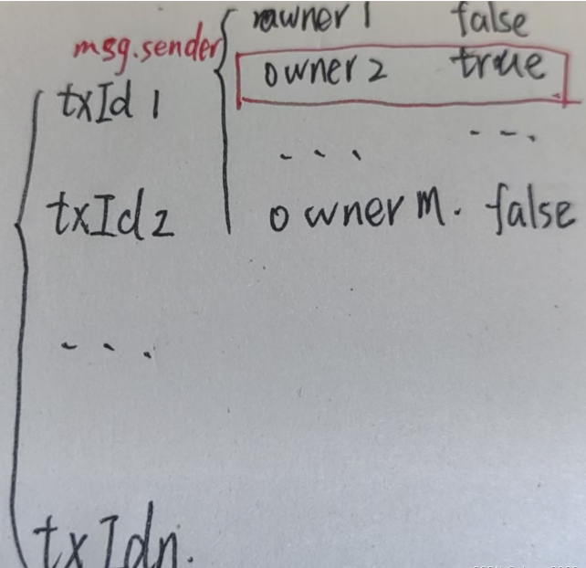

相交于硬件钱包的物理上丢失和密钥遗忘，多签名钱包在保证安全不易被破解的基础上，解决了部分密钥丢失的问题。

相比于BTC之前讲到的脚本钱包（BTC—脚本），ETH的多签钱包设计可以通过智能合约来实现

## 设计思路

### 工作原理

多签名钱包，可以是多个人使用多个签名，共同决议；也可以一个人使用多个签名，防止丢失。为了方便理解，下面的工作流程都按照多个人来解释

#### 进账

首先，向钱包转账不需要任何条件，来者不拒（dog）

#### 转出

如果是取钱就需要执行以下几个阶段的行动：

1. **提交交易申请：** 有一个账户发起交易，提交申请（申请记录到一个表中，等到申请通过销毁）
2. **批准交易或撤销交易：** 这一步执行是将申请列表的交易进行处理，所有的人负责决议是否通过该交易，而与此同时，所有人也可以撤销自己的决定
3. **执行交易：** 和单签名交易一样，将交易信息上链

## 代码实现

代码实现是先总体介绍数据类型,事件和构造函数，再按照功能块解释修饰器和函数

### 总体内容

#### 事件

```
//存款
event Deposit(address indexed sender, uint amount);//存款

////取款
//第一步
event Submit(uint indexed txId);//提交交易 等待其他人批准
//第二步
event Approve(address indexed owner, uint indexed txId);//通过交易
event Revoke(address indexed owner, uint indexed txId);//撤销交易
//第三步
event Execute(uint indexed txId);//执行交易
```

#### 数据类型

```
//1.交易和交易列表  只要交易被提交（第一步），就记录下来
struct Transaction {
        address to; //转账地址
        uint value; //转账金额
        bytes data; //转账数据
        bool executed; //是否已执行
        //bool approved; //是否批准
    }
Transaction[] public transactions; //交易列表

//2.钱包所有者信息
    address[] public owners; //合约所有者
    mapping(address => bool) public isOwner; //合约所有者地址


//3.要求至少签名数
    uint public required; //最少签名数


//4.待审批交易数据结构
mapping(uint => mapping(address => bool)) public approved; //交易编号->批准账户 二重调用！
```

#### 构造函数

```
 //构造函数
    constructor(address[] memory _owners, uint _required) {
        //判断存在钱包的所有人
        require(
            _owners.length > 0, 
            "the address is empty"
        );
        //判断钱包的要求支付者数量是合理的
        require(
            _required > 0 && _required <= _owners.length,
            "the required number is invalid"
        );
    
        //使用循环将用户地址数组中的用户插入到owners数组中
        for (uint i;i<_owners.length;i++){
            address owner = _owners[i];
            require(owner!= address(0), "owner address cannot be empty");
            require(!isOwner[owner], "owner address cannot be duplicated");

            isOwner[owner] = true;
            owners.push(owner);//插入新用户，这个数据结构用于存储用户账户
        }

        required = _required;//创建合约时设置最少签名数

    }
```

1. 构造函数在合约部署之初就写好了，也就是意味着其中需要记录钱包在上链时就要确定的信息！
2. 首先，要记下的是钱包所有者和要求签名数。两个判断语句就是这样想出来的
3. 之后，将传入的用户数组写进isOwner中，以便下方检验签名合法性使用

### 功能函数

#### 收款函数

```
receive() external payable {
        emit Deposit(msg.sender, msg.value);
    }//receive 在接收以太币时自动调用
```

receive函数在接收以太币时会自动调用，就是一个简单的自动记录功能

#### 提交申请函数

```
    modifier onlyOwner() {
       require(isOwner[msg.sender], "only owner can call this function");
       _; 
    }
    //外部可调用函数 只有合约所有者可以调用
    function submit(address _to, uint _value, bytes calldata _data)
        external
    onlyOwner
    {
        transactions.push(Transaction({
            to: _to,
            value: _value,
            data: _data,
            executed: false//尚未被审核的交易
        }));
    
        emit Submit(transactions.length - 1);//提交序号 原理和数组一样
    }
```

1. 修饰器，只允许创建账户之初的所有者（也就是账户的拥有者之一）调用这个函数
2. 函数中，输入一笔交易对应的信息，并将状态置于false，并且将这个交易提交到“交易列表“这个数据类型中
3. 记录日志

#### 通过和撤销交易

```
     modifier txExists(uint _txId){
        require(_txId < transactions.length, "transaction does not exist");
        _;
    }//交易编号小于交易列表数组长度

    modifier nonApproed(uint _txId){
        //mapping(uint => mapping(address => bool)) public approved;
        require(!approved[_txId][msg.sender],"only nonApproved TX can call this function" );//?
        _;
    }//使用到当时存储的待批准交易列表，判断当前用户是否已经批准过该交易

    modifier notExcuted(uint _txId){
       require(!transactions[_txId].executed, "transaction has been executed"); 
       _;
    }
    
    function approve(uint _txId)
        external
    onlyOwner
    txExists(_txId)
    nonApproed(_txId)
    notExcuted(_txId)
    {
        approved[_txId][msg.sender] = true;
        emit Approve(msg.sender, _txId);
    }
    
    //撤销交易
    function revoke(uint _txId) external 
    onlyOwner 
    txExists(_txId)  
    notExcuted(_txId)
    {
        require(approved[_txId][msg.sender], "only approved TX can be revoked");
        approved[_txId][msg.sender] = false;
        emit Revoke(msg.sender, _txId);
    } 
}
```

1. 首先，能够进行”第二步“的交易需要以下的状态：

   1. 被记录在交易列表中（使用编号和长度对比判断），说明这个交易被提交了
   2. 还未被大家审议通过（这里使用approved双重映射表来实现）
   3. 还没被执行（这里使用的是交易里面的executed状态来实现）

2. 对于批准函数，如果发现这个交易在交易列表（transactions）中，函数调用者是钱包所有人之一，交易未执行（最后一步）就可以将交易的该所有人一项记为true。

   ​​​​

3. 对于撤销函数，每个人可以撤销自己的审批决定

#### 执行函数

```
function approve(uint _txId)
        external
    onlyOwner
    txExists(_txId)
    nonApproed(_txId)
    notExcuted(_txId)
    {
        approved[_txId][msg.sender] = true;
        emit Approve(msg.sender, _txId);
    }

    function _getApprovalCount(uint _txId) private view returns(uint count)    {
        for(uint i;i < owners.length;i++){
            if(approved[_txId][owners[i]]){
                count++;
            }
        }
        //隐式返回值 不需要return语句
    }

    //执行交易
    function excute(uint _txId) external txExists(_txId) notExcuted(_txId){

        require(_getApprovalCount(_txId) >= required, "not enough approvals");     
        Transaction storage transaction = transactions[_txId];
    
        transaction.executed = true;

        (bool success, ) = transaction.to.call{value: transaction.value}(transaction.data);//检查交易是否发送执行成功
        require(success, "transfer failed");

        emit Execute(_txId);

    }
```

1. 首先，写一个函数计算某个交易拥有的通过者的数量，满足required就可以执行；
2. 检查交易是否发送执行成功

## 源代码

```
// SPDX-License-Identifier: MIT
pragma solidity ^0.8.10;

contract MultiSigWallet {
    //创建事件
    event Deposit(address indexed sender, uint amount);//存款

    event Submit(uint indexed txId);//提交交易 等待其他人批准
    event Approve(address indexed owner, uint indexed txId);//
    event Revoke(address indexed owner, uint indexed txId);//撤销交易
    event Execute(uint indexed txId);//执行交易


    struct Transaction {
        address to; //转账地址
        uint value; //转账金额
        bytes data; //转账数据
        bool executed; //是否已执行
        //bool approved; //是否批准
    }
    Transaction[] public transactions; //交易列表
    
    
    address[] public owners; //合约所有者 
    mapping(address => bool) public isOwner; //合约所有者地址
    
    
    uint public required; //最少签名数

    
    mapping(uint => mapping(address => bool)) public approved; //交易编号->批准账户

    //构造函数
    constructor(address[] memory _owners, uint _required) {
        require(
            _owners.length > 0, 
            "the address is empty"
        );
        require(
            _required > 0 && _required <= _owners.length,
            "the required number is invalid"
        );
    
        //使用循环将用户地址数组中的用户插入到owners数组中
        for (uint i;i<_owners.length;i++){
            address owner = _owners[i];
            require(owner!= address(0), "owner address cannot be empty");
            require(!isOwner[owner], "owner address cannot be duplicated");

            isOwner[owner] = true;
            owners.push(owner);//插入新用户，这个数据结构用于存储用户账户
        }

        required = _required;//创建合约时设置最少签名数

    }

    modifier onlyOwner() {
       require(isOwner[msg.sender], "only owner can call this function");
       _; 
    }


    modifier txExists(uint _txId){
        require(_txId < transactions.length, "transaction does not exist");
        _;
    }//交易编号小于交易列表数组长度

    modifier nonApproed(uint _txId){
        //mapping(uint => mapping(address => bool)) public approved;
        require(!approved[_txId][msg.sender],"only nonApproved TX can call this function" );//?
        _;
    }//使用到当时存储的待批准交易列表，判断当前用户是否已经批准过该交易

    modifier notExcuted(uint _txId){
       require(!transactions[_txId].executed, "transaction has been executed"); 
       _;
    }

    receive() external payable {
        emit Deposit(msg.sender, msg.value);
    }//receive 在接收以太币时自动调用

    //外部可调用函数 只有合约所有者可以调用
    function submit(address _to, uint _value, bytes calldata _data)
        external
    onlyOwner
    {
        transactions.push(Transaction({
            to: _to,
            value: _value,
            data: _data,
            executed: false//尚未被审核的交易
        }));
    
        emit Submit(transactions.length - 1);//提交序号 原理和数组一样
    }

    function approve(uint _txId)
        external
    onlyOwner
    txExists(_txId)
    nonApproed(_txId)
    notExcuted(_txId)
    {
        approved[_txId][msg.sender] = true;
        emit Approve(msg.sender, _txId);
    }

    function _getApprovalCount(uint _txId) private view returns(uint count)    {
        for(uint i;i < owners.length;i++){
            if(approved[_txId][owners[i]]){
                count++;
            }
        }
        //隐式返回值 不需要return语句
    }

    //执行交易
    function excute(uint _txId) external txExists(_txId) notExcuted(_txId){

        require(_getApprovalCount(_txId) >= required, "not enough approvals");     
        Transaction storage transaction = transactions[_txId];
    
        transaction.executed = true;

        (bool success, ) = transaction.to.call{value: transaction.value}(transaction.data);
        require(success, "transfer failed");

        emit Execute(_txId);

    }

    //撤销交易
    function revoke(uint _txId) external 
    onlyOwner 
    txExists(_txId) 
    //nonApproed(_txId) 
    notExcuted(_txId)
    {
        require(approved[_txId][msg.sender], "only approved TX can be revoked");
        approved[_txId][msg.sender] = false;
        emit Revoke(msg.sender, _txId);
    } 
}
```

## 合约审计

1. 终端输入`truffle compile`,将合约编译成.json文件

2. 书写脚本<test2.js>

   ```
   const Web3 = require('web3');
   const MultiSigWallet = artifacts.require('MultiSigWallet');
   
   // 配置web3连接
   const web3 = new Web3('http://localhost:8545');
   
   // 实例化合约
   const contractAddress = '0x123...'; // 合约地址
   const multiSigWallet = new web3.eth.Contract(MultiSigWallet.abi, contractAddress);
   
   // 测试用账户
   const account1 = '0xabc...'; // 账户1
   const account2 = '0xdef...'; // 账户2
   
   // 测试存款事件
   multiSigWallet.methods.deposit().send({
       from: account1,
       value: web3.utils.toWei('1', 'ether')
   }).on('receipt', function(receipt){
       console.log('Deposit event emitted:', receipt.events.Deposit);
   });
   
   // 测试提交交易
   multiSigWallet.methods.submit(account2, web3.utils.toWei('0.5', 'ether'), '0x').send({
       from: account1
   }).on('receipt', function(receipt){
       console.log('Submit event emitted:', receipt.events.Submit);
   });
   
   // 测试批准交易
   multiSigWallet.methods.approve(0).send({
       from: account2
   }).on('receipt', function(receipt){
       console.log('Approve event emitted:', receipt.events.Approve);
   });
   
   // 测试执行交易
   multiSigWallet.methods.execute(0).send({
       from: account1
   }).on('receipt', function(receipt){
       console.log('Execute event emitted:', receipt.events.Execute);
   });
   
   // 测试撤销交易
   multiSigWallet.methods.revoke(0).send({
       from: account1
   }).on('receipt', function(receipt){
       console.log('Revoke event emitted:', receipt.events.Revoke);
   });
   ```

   

3. 输入`truffle test`，使用测试脚本检查合约

4. 输入`truffle develop`,使用ganache创建账户和私钥

5. 编写部署脚本

   ```
   const Web3 = require('web3');
   const MultiSigWallet = artifacts.require('MultiSigWallet');
   
   // 配置web3连接
   const web3 = new Web3('http://localhost:8545');
   
   // 测试用账户
   const account = '0xabc...'; // 使用的账户地址
   
   // 部署合约
   module.exports = function(deployer, network, accounts) {
     deployer.deploy(MultiSigWallet, [accounts[0], accounts[1], accounts[2]], 2, { from: account })
       .then(function(newMultiSigWallet) {
         console.log('MultiSigWallet deployed at:', newMultiSigWallet.address);
       });
   };
   ```

   

6. 终端输入`migrate --reset`执行，查看本地部署的模拟结果