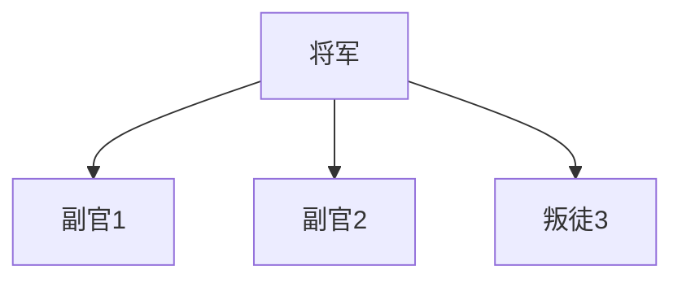
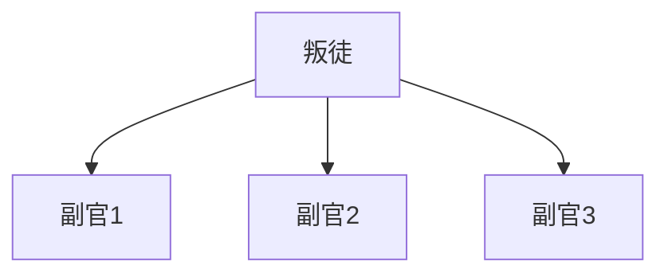

# 写在前面

这个专栏的文章是基于Tintinland社区的区块链通识课，结合我对于web3当前发展、现有生态在之前“区块链基础技术2018”的基础上写的文章。因此，里面涉及到之前的内容（比如本篇的脚本、分叉和默尔克树），都会简单的提及或者在之前的基础上进行拓展。本专栏文章共有四篇，这篇是比特币，涉及的内容还是相对较老；但是读完这个专栏的文章，相信会对当前区块链的发展有一定的认知和基础，欢迎大家在评论区或者私信对我的文章进行批评纠正，十分期待与大家进行讨论。

由于BTC的新兴事物并不多，所以本篇采取问题式的方式铺陈。

# 拜占庭将军问题

## 背景

在网络上的节点分为恶意节点（目的是扰乱一致性）和故障节点（挂机）。拜占庭问题解决的是拥有恶意节点的问题；拥有故障节点的成为“非拜问题”

首先，我们来补充一下分布式账本的节点问题。拜占庭问题是由兰波特提出的，为了解决这个问题，采用了从理想化的“口头协议”-->解决网络延时的“PBFT算法”-->区块链使用的“PoW机制”

## 问题本身

拜占庭帝国派出多支军队进攻一个城池，这个城池十分坚固，一支部队无法攻克，但是多支军队一起攻打即可攻克。现在，将军中有叛徒，他的目的是使得忠诚的部队行动不一致。这个问题有解的前提是n(总节点个数)>3m(恶意节点个数)。

## 问题解法

### 口头协议

这个解法

这个方案是兰波特给出的最初解，采用的是递归的思想，优点是比较简单直接，缺点是算法复杂度高、而且没有考虑信息传输的实效性问题。

### PBFT（）算法

为了应对“口头协议”存在的问题，后来的学者提出了很多拜占庭容错算法，例如：实用拜占庭容错算法（PBFT）、

# 分布式账本

众所周知，我们的区块链可以通俗理解为一个分布式的账本。大家提及这个账本时，最多谈到的是去中心化、不可冻结、分布式、共识、溯源、不可更改等等概念，但是我们如果回归这个账本的本质，首先要提出的就是以下的三个问题：

1. 谁能在这个账本上记账？
2. 如何保证分布式账本的每份账本是一样的？
3. 如何让参与者去维持这种“一致”？

## 谁能记账

在传统的银行体系（中心化电子商务）中，货币是银行产出的，所谓的资产转移不过是银行将你的资产划给别人（在数据库中改两个数据）。这个和古代的“一手交钱”是不一样的，不同的地方就在于，你的资产本质上是银行承认的，如果这个银行倒闭了，那就没人承认你的资产！这就是中心化的金融体系——中心存在时，货币和资产是有意义的；中心不存在时，资产和货币就没有意义了。

而去中心化的金融体系，就可以理解为原始社会的以物换物，或者那黄金白银换东西。哪怕这个部落不存在了，我的“资产”的价值依旧不受影响